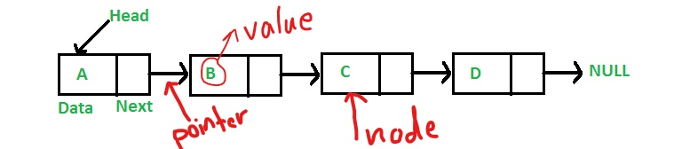

# Singly Linked List 
* is linear data structure thats contains nodes and the nods contains value and pointer to the next node , as showen below 

    * node − Each node of a linked list can store a data called an element.

    * Next − Each node of a linked list contains a pointer to the next node called Next.

    * LinkedList − A Linked List contains the connection  to the first node called Head.

* Linked List Applications . .
    * Dynamic memory allocation
    * Implemented in stack and queue

## Linked List Implementation challeng 
* in this challenge we have to use ES6 classes to implement singly linked list .
* first we have to create the Node class and in the node should store value and pointer to the next node .
* we have to create linked list class , to implement linked list with 3 required method 
    * insert Arguments: value ,Adds a new node with that value to the head of the list with an O(1) Time performance.
    * includes Arguments: value Returns: Boolean Indicates whether that value exists as a Node’s value somewhere within the list.
    * to string Returns: a string representing all the values in the Linked List, formatted
- [x] create node class , with the value proprty and pointer to the next node
- [x] create Linked list class with the head proparity 
- [x] create insert method for linked list 
- [x] create includes method for linked list 
- [x] create toString method for linked list 

 ### Structure and Testing
 * we have to do 7 tests for the challenge 

- [x] Can successfully instantiate an empty linked list
- [x] Can properly insert into the linked list
- [x] The head property will properly point to the first node in the linked list
- [x] Can properly insert multiple nodes into the linked list
- [x] Will return true when finding a value within the linked list that exists
- [x] Will return false when searching for a value in the linked list that does not exist
- [x] Can properly return a collection of all the values that exist in the linked list

## Approach & Efficiency
* first I create the node class to be blue print for all node , then I created the linked list class with requird three methods 1- instert  2- includes  3- toString 

> the big O notation for my methods will be like 

| Methode     | Time Complexity  | Space Complexity     |
| :---        |    :----:        |     ---:      |
| Insert      |    O(1)          |      O(n)     |
| Includes    |    O(n)          |      O(1)     |
| TosTring    |    O(n)          |      O(n)     |

* insert methode time O(1) inserting constantlity one a time , and for the space it will take memory for the n of nodes 
* includes method time O(n) we have to search for each node that contain requierd value , and it is give constant result so , space will be O(1)
* toString method it will search for all value in the list so time will be O(n) and it will print all value so the memory space will be O(n)

* after I created the linked list list class and methode , I started with insert method to instet new node in the list with the requierd value 
* then I created the includes method that will check if the value that given is found in the list and return True if there and false if it is not there 
* then I created the last method toString that will print all the vlaue in the console in proper way . see my result below 
.png)

* then I started with the TDD and I prepared 7 tests for the linked list as showen below .
- [x] Can successfully instantiate an empty linked list
- [x] Can properly insert into the linked list
- [x] The head property will properly point to the first node in the linked list
- [x] Can properly insert multiple nodes into the linked list
- [x] Will return true when finding a value within the linked list that exists
- [x] Will return false when searching for a value in the linked list that does not exist
- [x] Can properly return a collection of all the values that exist in the linked list
.png)

* we can use different method also in My linked list like delete or remove , insert by index ...etc 

