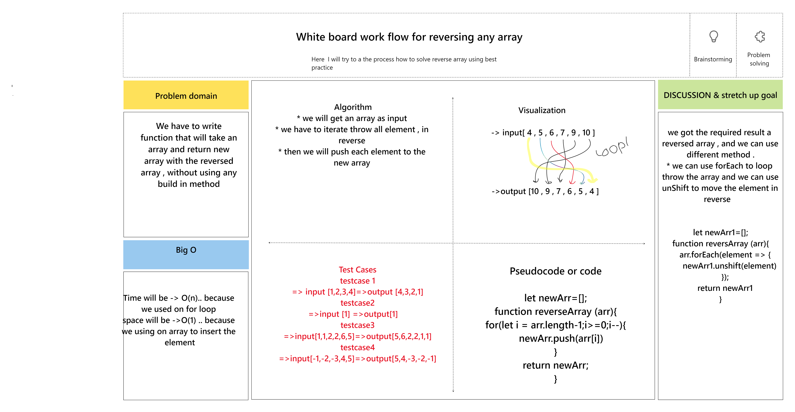

## White board challenge to reverse array

* we used white board to see the work flow for solving the revesed array challenge .
* the task is to get an array as input , so we need to creat function that will take the array and iterate throw it element and reversed it 
* also in the white board we mention some heading 
    1. problem domain 
    2. Algorithm 
    3. TestCases 
    4. Visual drawing for solution 

* as shown below 

 

 * the challenge solution is by code .

.png)

* this is the test result 
.png)