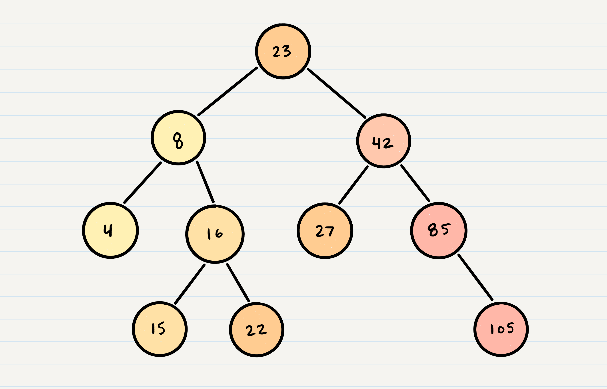

# Tree search 
## Introduction 
* Binary Search Trees
A Binary Search Tree (BST) is a type of tree that does have some structure attached to it. In a BST, nodes are organized in a manner where all values that are smaller than the root are placed to the left, and all values that are larger than the root are placed to the right.
* so this is binery search tree or balanced tree 


* The Big O time complexity of a Binary Search Tree’s insertion and search operations is O(h), or O(height). In the worst case, we will have to search all the way down to a leaf, which will require searching through as many nodes as the tree is tall. In a balanced (or “perfect”) tree, the height of the tree is log(n). In an unbalanced tree, the worst case height of the tree is n.
The Big O space complexity of a BST search would be O(1). During a search, we are not allocating any additional space.
## Lap requirment
* Binary Tree
    * Create a Binary Tree class
    * Define a method for each of the depth first traversals:
    * pre order
    * in order
    * post order which returns an array of the values, ordered appropriately.
* Binary Search Tree
    * Create a Binary Search Tree class
    * This class should be a sub-class (or your languages equivalent) of the Binary Tree Class, with the following additional methods:
    * Add
    * Arguments: value
    * Return: nothing
    * Adds a new node with that value in the correct location in the binary search tree.
* Contains
    * Argument: value
    * Returns: boolean indicating whether or not the value is in the tree at least once.

* Befor start when I started to think how to implemnt binary search tree mY mind was doing this 


> note that we implemnt binery tree in the class , we use the same approch , and the big challenge to implement Binery search tree
* so I will print all result in console for binery tree methods ,we implement all 3 method and this is the test sample result 
.png)

* so for Binery search tree the asked for sub class from the main class is binery tree , and ther required two method , inside sub class , first Add with argument value : we will add new value to our tree in proper location  , the second one in Contains with argument value , we will compare this value in all our value in the tree if we find it we will return true 

* so in Add we will use it add sub class proprety , also we will use other function to do recursion to check all nodes as shown 

````
class binarySearchTree extends binaryTree{

    Add(value){
        if(this.root==null){
            this.root=new node(value) 
            return
        }
        
        let addValue=(result)=>{
        if (value>result.value){
            if(!result.right){
                result.right=new node(value)
               
            }
           
            addValue( result.right);
        }
        if(value<result.value){
            if(!result.left){
                result.left=new node(value)
               
            }
             
            addValue(result.left)
        }
    }
    addValue(this.root)
    }
   ````
* For first result check I created new node with value of three and I created new binary tree and I inserted node with three as value in the tree and I added four value 2 value less than three and 2 value more than  three so the result will be as shown 
.png)

* now the second property of our sub class in Contains , simply we will do search for spacific value in the tree if we find we will return true , and if not found we will return false 

````
   Contains(value){
        if(!this.root.value){
            return false
        }
            let search = (result) => {
              if (result.value == value) {
                return true
            } else if (result.value > value) {
                if (!result.left) {
                  return false;
                }
                return search(result.left)
            }
            else {
                if (!result.right) {
                  return false;
                }
                return search(result.right);
              }
              
        
}
return search(this.root)
}
````
* and let see index result we will search for 4 values in our tree , 2 is already there in our tree and 2 not there 

.png)

* now lets start with jest test , required 7 tests 
- [x] constructor creating property and instance of binary tree
- [x] For a Binary Search Tree, can successfully add a left child and right child properly to a node
- [x] preOrder for  binary tree
- [x] inOrder for  binary tree
- [x] postOrder for  binary tree
- [x] Returns true false for the contains method, given an existing or non-existing node value

* and this the image for test from my index page '

.png)
