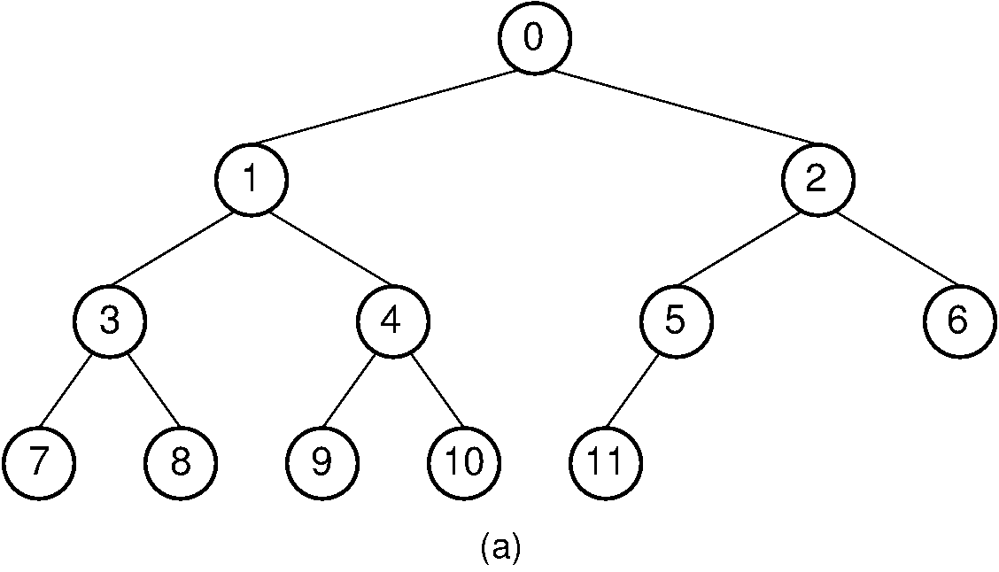

# Tree search 
## Introduction 
* A binary tree is a tree data structure composed of nodes, each of which has at most, two children, referred to as left and right nodes. The tree starts off with a single node known as the root. Each node in the tree contains left , right , and value.

## what required in this challenge 
* Write the following method for the Binary Tree class

     * find maximum value
    * Arguments: none
    * Returns: number
    * Find the maximum value stored in the tree. You can assume that the values stored in the Binary Tree will be numeric.

    

    * so we need to return maximum value in our tree that equal to 11 

    * lets start with white bored picture 

    


    * I did 2 approch for solution the first on I Will take O(n)for time and o(1)for space 
    ````

  findMax(){
        let max = this.root.value
        let search=(input)=>{
            if(input.left)
                // if(input.value>max )
                //     max = input.value
                
                search(input.left)
                // return max
            
            if(input.right)
                // if(input.value>max )
                //     max = input.value
                
                search(input.right)
                // return max  
            
            if (input.value>max) max = input.value 
            
        }
        search(this.root)
        return max
    }

    ````
    * let see the result in the console 

    .png)

    * for the second approach will take O(n) for time and O(n) for space beacuse I used to save all value in array and I get the max value from array
```
    
  
 findMax2(){
        let result=[]
        let Trvers=(node)=>{
            result.push(node.value)
            if(node.left) Trvers(node.left)
            if(node.right) Trvers(node.right)
        }
        Trvers(this.root)
        return Math.max(...result)
   ```
   * let see the result from console 
   .png)

   * lets start with jest test I did 2 test that we can find max value for any tree and it is successed , and we dont forget to do test that we did before:
   .png)
  

