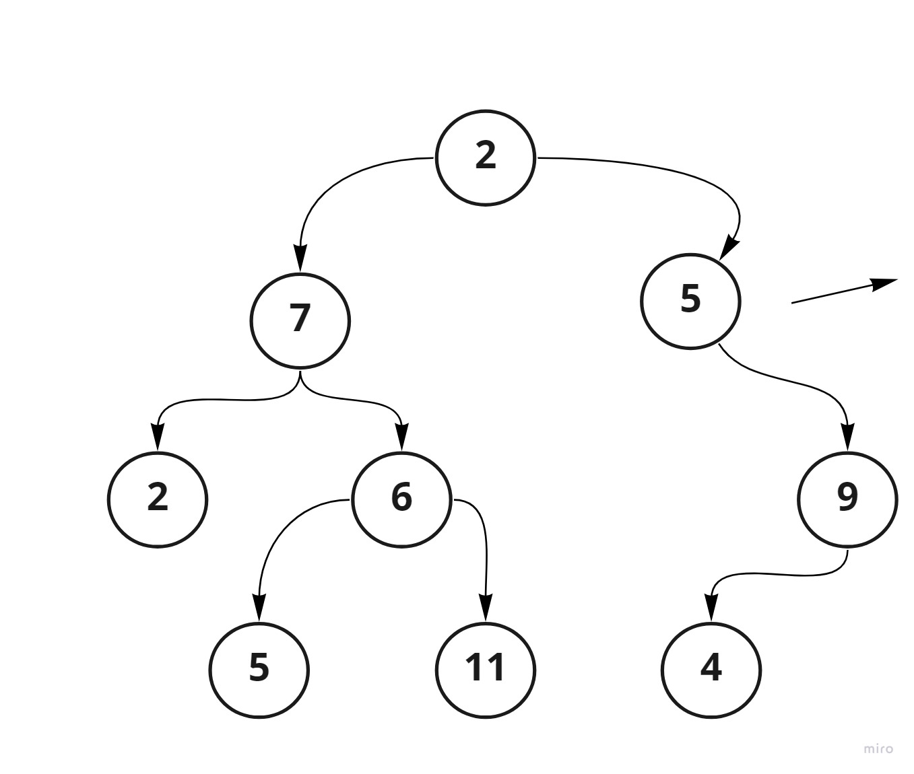

# Tree search breadth first ch17
## Introduction 
* Trees are one of the most fundamental data structures. They are used to store and organize data.

* A binary tree is a tree data structure composed of nodes, each of which has at most, two children, referred to as left and right nodes. The tree starts off with a single node known as the root.

Each node in the tree contains the following:

* Value
* Pointer to the left child
* Pointer to the right child 

### what is required in this lap 
* first let start with white bored image ; 


* what I did is I wrote a function that will take tree as input 
* so I used Queue class constructor , to save value in the Queue , and also I will use Queue methods , like enqueue and dequeue 
* then I declared varibale , as array to push all value inside it 
* so first thing I will enqueue (tree.root) in our Queue then I will loop throw the queue until it is empty 
* I will put , the dequeued node in our current variable , then I will push result to the array , so first result pushed will be root value and we will check from left , if there is left we will enqueue left then we will enqueue right in our Queue , then again we will dequeue the node from Queue it will be left value , so we will push it to our array 

```
function breadthFirst(tree){
    let store=new Queue()
    let result=[]
    let current;
    store.enqueue(tree.root)
    while(store.length ){
        current=store.dequeue()
        result.push(current.value)
        if(current.left) store.enqueue(current.left)
        if(current.right) store.enqueue(current.right)
    }
    return result
}   
```
* let see the result , so our input tree will be like test case 



* So the expected out put will be  **[ 2 , 7 , 5 , 2 , 6 , 9 , 5 , 11 , 4 ]**

* Before we test it we will make the same tree using code As shown below :
```
let Tree = null

let one = new Node(1);
let two = new Node(2);
let three = new Node(3);
let four = new Node(4);
let five = new Node(5);
let six = new Node(6);
let seven = new Node(7);
let eight = new Node(8);
let nine = new Node(9);

two.left = seven;
two.right =five;
seven.left = new Node(2);
seven.right = six;*
six.left =new Node(5);
six.right = new Node(11);
five.right = nine;
nine.left = four;
```


* so this is the result shown in the index same as the expected result 

.png)

* also I did jest test for this fuction , on diferent tree , it is worked as shown 

.png)