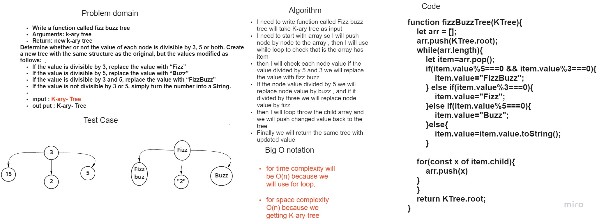
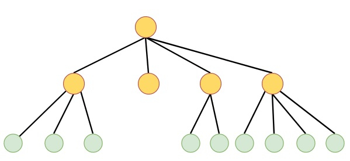

# Tree FizzBuzzTree ch18
## Introduction 
* Trees are one of the most fundamental data structures. They are used to store and organize data.

*  The K-ary tree is a rooted tree, where each node can hold at most k number of children.

If the value of k is 2, then this is known as binary tree. The binary tree, or ternary trees are some specialized k-ary trees. So k-ary trees re generalized.

* Value
* childs , as []
### what is required in this lap 

* first let start with white bored image ; 
 

* K - ary -Tree look like this pic : 



* before we start , we prepare new class constructor for the K ary tree , 

* I need to write function called Fizz buzz tree will take K-ary tree as input
I need to start with array so I will push node by node to the array , then I will use while loop to check that is the array has item
then I will check each node value if the value divided by 5 and 3 we will replace the value with fizz buzz
If the node value divided by 5 we will replace node value by buzz , and if it divided by three we will replace node value by fizz
then I will loop throw the child array and we will push changed value back to the tree
Finally we will return the same tree with updated value

```
function fizzBuzzTree(KTree){
    let arr = [];
    arr.push(KTree.root);
    while(arr.length){
        let item=arr.pop();
        if(item.value%5===0 && item.value%3===0){
            item.value="FizzBuzz";
        } else if(item.value%3===0){
            item.value="Fizz";
        }else if(item.value%5===0){
            item.value="Buzz";
        }else{
            item.value=item.value.toString();
        }

    for(const x of item.child){
        arr.push(x)
    }
    }
    return KTree.root;
}

```
* let see the out put result 

.png) 

* and this is the jest test sample 

.png)


