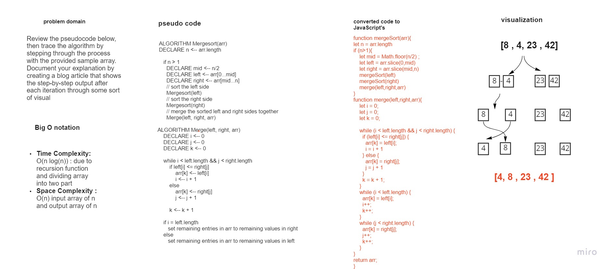

# Code Challenge: Class 27

### Assignment
Review the pseudocode below, then trace the algorithm by stepping through the process with the provided sample array. Document your explanation by creating a blog article that shows the step-by-step output after each iteration through some sort of visual.

* We need to convert pseudo code to javascript code and follow the steps 
* lets start with white bored picture 

* I go threw the steps as shown below : 
     * first step 
     
.png)

* and here index final result

.png)

* this is the result for the jest test , one test only 

.png)

