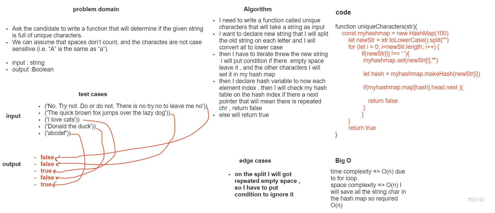

# Code Challenge: 34
## Implement a unique characters 

### Introduction
* What Are the Hashtables : they are a data structure that utilize key value pairs. This means every Node or Bucket has both a key, and a value.

* The basic idea of a hashtable is the ability to store the key into this data structure, and quickly retrieve the value. This is done through what we call a hash. A hash is the ability to encode the key that will eventually map to a specific location in the data structure that we can look at directly to retrieve the value.


### what required in this lap 
*  write a function that will determine if the given string is full of unique characters.
* We can assume that spaces don’t count, and the charactes are not case sensitive (i.e. “A” is the same as “a”).


## what I did in this task  
* lets start with the white board pic 



### my approach 


* I need to write a function called unique characters that will take a string as input
I want to declare new string that I will split the old string on each letter and I will convert all to lower case
then I have to iterate threw the new string  i will put condition if there  empty space leave it , and the other characters I will set it in my hash map
then I declare hash variable to now each element index , then I will check my hash table on the hash index if there a next pointer that will mean there is repeated chr , return false
else will return true
 
 * my code 
 ```
 function uniqueCharacters(str){
    const myhashmap = new HashMap(100)
        let newStr = str.toLowerCase().split("")
        for (let i = 0; i<newStr.length; i++) {
                if(newStr[i] !== ' '){
                 myhashmap.set(newStr[i],"")
                //  console.log(newStr)
                 let hash = myhashmap.makeHash(newStr[i])
                 console.log(myhashmap.map[hash].head)
                 if(myhashmap.map[hash].head.next ){
                    // console.log(myhashmap.map[hash].head)
                    return false
                 }
                }
                    
                 
        }
        return true
}
```


* and this ism my index result 

.png)

.png)


## Structure and Testing

### after we finish from the method now is the testing parts , and I prepared these tests for this challenge 

* [x] ist test case that alote of repeated characters

* [x] 2nd test case also has repeated char characters
* [x] 3nd test case also has no repeated char characters with some spaces
* [x] 4nd test case also has noo repeated char characters with no spaces

.png)


