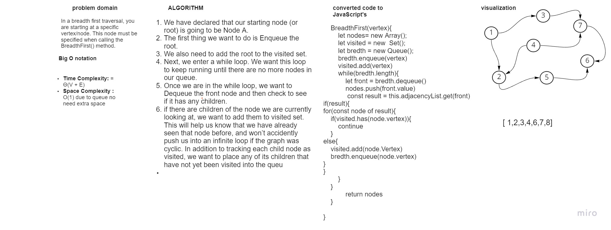

# Code Challenge: 36
## Implement a graph and traverse bredth first 

### Introduction
* Breadth First
In a breadth first traversal, you are starting at a specific vertex/node. This node must be specified when calling the BreadthFirst() method. The breadth first traversal of a graph is like that of a tree, with the exception that graphs can have cycles. Traversing a graph that has cycles will result in an infinite loop….this is bad. To prevent such behavior, we need to have some way to keep track of whether a vertex has been “visited” before. Upon each visit, we’ll add the previously-unvisited vertex to a visited set, so we know not to visit it again as traversal continues.

As a refresher of what breadth first actually means here it is: Breadth first traversal is when you visit all the nodes that are closest to the root as possible. From there you traverse outwards, level by level, until you have visited all the vertices/nodes.

Here is what the algorithm breadth first traversal looks like:

* Enqueue the declared start node into the Queue.
* Create a loop that will run while the node still has nodes present.
* Dequeue the first node from the queue
* if the Dequeue‘d node has unvisited child nodes, add the unvisited children to visited set and insert them into the queue.

###  white bored pic 



* pseudo code 

```
ALGORITHM BreadthFirst(vertex)
    DECLARE nodes <-- new List()
    DECLARE breadth <-- new Queue()
    DECLARE visited <-- new Set()

    breadth.Enqueue(vertex)
    visited.Add(vertex)

    while (breadth is not empty)
        DECLARE front <-- breadth.Dequeue()
        nodes.Add(front)

        for each child in front.Children
            if(child is not visited)
                visited.Add(child)
                breadth.Enqueue(child)

    return nodes;

```


    * javsscripts code 

 ```
     BreadthFirst(vertex){
        let nodes= new Array();
        let visited = new  Set();
        let bredth = new Queue();
        bredth.enqueue(vertex)
        visited.add(vertex)
        while(bredth.length){
            let front = bredth.dequeue()
            nodes.push(front.value)
             const result = this.adjacencyList.get(front)
if(result){
for(const node of result){
    if(visited.has(node.vertex)){
        continue
    }
else{
    visited.add(node.Vertex)
    bredth.enqueue(node.vertex)
}
}
        }
    }

            return nodes
    }

}
```
* index result 

.png)
