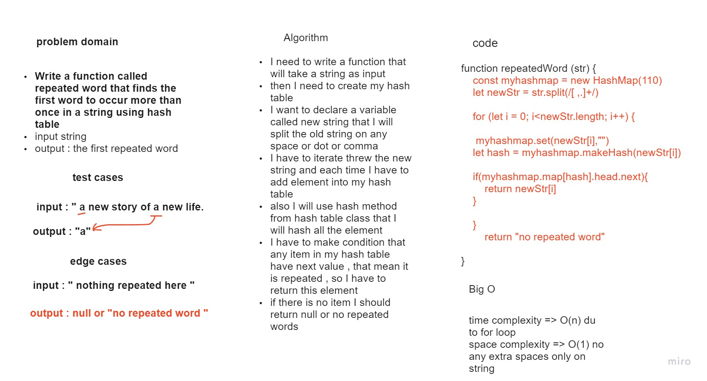

# Code Challenge: 31
## Hash Table / Repeated Word

### Introduction
* What Are they
Hashtables are a data structure that utilize key value pairs. This means every Node or Bucket has both a key, and a value.

* The basic idea of a hashtable is the ability to store the key into this data structure, and quickly retrieve the value. This is done through what we call a hash. A hash is the ability to encode the key that will eventually map to a specific location in the data structure that we can look at directly to retrieve the value.

### what required in this lap 
* Write a function called repeated word that finds the first word to occur more than once in a string using hash table 

        * input  : string
        * output : the first repeated word

### what I did in this lap 

* I need to write a function that will take a string as input
* then I need to create my hash table
* I want to declare a variable called new string that I will split the old string on any space or dot or comma
* I have to iterate threw the new string and each time I have to add element into my hash table
* also I will use hash method from hash table class that I will hash all the element
 * I have to make condition that any item in my hash table have next value , that mean it is repeated , so I have to return this element
* if there is no item I should return null or no repeated words

* here is the white board image 



### here is the code for the solution 

```
function repeatedWord (str) {
    const myhashmap = new HashMap(110)
    let newStr = str.toLowerCase().split(/[ ,.]+/)
    console.log(newStr)
    for (let i = 0; i<newStr.length; i++) {
    
     myhashmap.set(newStr[i],"")
    let hash = myhashmap.makeHash(newStr[i])
    // console.log(myhashmap.map[hash].head)
    if(myhashmap.map[hash].head.next){
        return newStr[i]
    }
    
    }
        return "no repeated word"
    
}
```
* this is my result from index console all the test cases given , and when there is no repeated word 

.jpg)

.jpg)

.jpg)


## Structure and Testing

### after we finish from the method now is the testing parts , and I prepared these tests for this challenge [this is the link to my test](./__test__/index.test.js)

* [x] I prepared 3 tests for the given test cases and the expected output as given ("a" , "the" , "summer")
* [x] I prepared test case if there is no repeated word so it will return message that is say "no repeated word "

* this is my test result as shown below :

.png)


