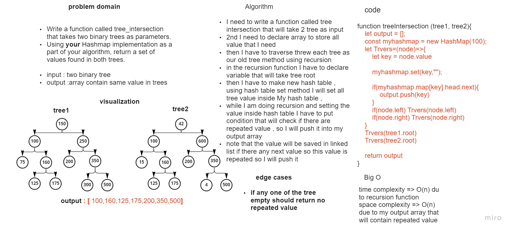

# Code Challenge: 32
## Hash Table - Tree Intersection

### Introduction
* What Are they
Hashtables are a data structure that utilize key value pairs. This means every Node or Bucket has both a key, and a value.

* The basic idea of a hashtable is the ability to store the key into this data structure, and quickly retrieve the value. This is done through what we call a hash. A hash is the ability to encode the key that will eventually map to a specific location in the data structure that we can look at directly to retrieve the value.

### what required in this lap 
* Write a function called tree_intersection that takes two binary trees as parameters.
 Using your Hashmap implementation as a part of your algorithm, return a set of values found in both trees.

    * input : two binary tree
    * output :array contain same value in trees


### what I did in this lap 

* lets start with whit bored image 



### > note that I did small modification on the hash map , hashing method that it can take numbers directly , 

* I need to write a function called tree intersection that will take 2 tree as input
2nd I need to declare array to store all value that I need
then I have to traverse threw each tree as our old tree method using recursion
in the recursion function I have to declare variable that will take tree root
then I have to make new hash table , using hash table set method I will set all tree value inside My hash table ,
while I am doing recursion and setting the value inside hash table I have to put condition that will check if there are repeated value , so I will push it into my output array
note that the value will be saved in linked list if there any next value so this value is repeated so I will push it


* this is my code for the solution 

```
function treeIntersection (tree1, tree2){
    if(tree1.root ==null || tree2.root==null){
        return 'no repeated value'
    }

    let output = [];
    const myhashmap = new HashMap(100);
    let Trvers=(node)=>{
        let key = node.value
        console.log(key)
        myhashmap.set(key,"");
        console.log(myhashmap.map[key].head)
        if(myhashmap.map[key].head.next){
            output.push(key)
        }
        if(node.left) Trvers(node.left)
        if(node.right) Trvers(node.right)
    }
    Trvers(tree1.root)
    console.log("*********************") 
    Trvers(tree2.root)

    return output
}
```

* I also prepared 2 tree as input to test the function 


* and this is the code for implementation for two tree with the same values 
```
let Tree = null
let Tree2 = null 
let n =new Node(4)
let n2 =new Node(15)
let n3 =new Node(42)
let one = new Node(75);
let two = new Node(100);
let two1 = new Node(100);
let a= new Node(125);
let three = new Node(150);
let four = new Node(160);
let four1 = new Node(160);
let five = new Node(175);
let six = new Node(200);
let seven = new Node(250);
let eight = new Node(300);
let nine = new Node(350);
let nine1 = new Node(350);
let ten = new Node(500);
let eleven = new Node(600);
// Tree 1 implementation
three.left = two1;
three.right = seven;
two1.left = new Node(75);
two1.right = four1;
seven.left = six;
seven.right = nine1 ;
four1.left = a;
four1.right = five;
nine1.left=eight;
nine1.right=ten;
Tree= new binaryTree(three)

// Tree 2 implementation
n3.left=two;
n3.right=eleven;
two.left=n2;
two.right=four;
four.left=a
four.right=five;
eleven.left=six;
eleven.right=nine
nine.left=n
nine.right=ten
Tree2= new binaryTree(n3)
```


* lets see the index result for the first tree 

.png)

* and here for the second tree and each repeated value will be save in the same hashed key 

.png)

* and finally here is the final result out put 

.png)


## Structure and Testing
after we finish from the method now is the testing parts , and I prepared these tests for this challenge this is the link to my test [link to my jest test](./__test__/index.test.js).

 I prepared 2 test one if we have any tree empty , the second test with the required result 

this is my test result as shown below :

.png)


