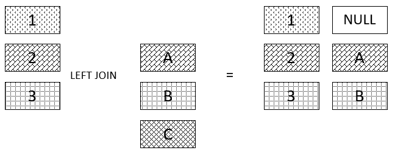

# Code Challenge: 33
## Implement a simplified LEFT JOIN for 2 Hashmaps

### Introduction
* What Are the Hashtables : they are a data structure that utilize key value pairs. This means every Node or Bucket has both a key, and a value.

* The basic idea of a hashtable is the ability to store the key into this data structure, and quickly retrieve the value. This is done through what we call a hash. A hash is the ability to encode the key that will eventually map to a specific location in the data structure that we can look at directly to retrieve the value.

### what is the left join 
* The SQL LEFT JOIN returns all rows from the left table, even if there are no matches in the right table. This means that if the ON clause matches 0 (zero) records in the right table; the join will still return a row in the result, but with NULL in each column from the right table.

* This means that a left join returns all the values from the left table, plus matched values from the right table or NULL in case of no matching join predicate.



### what required in this lap 
* Write a function that LEFT JOINs two hashmaps into a single data structure.

* Write a function called left join
* Arguments: two hash maps
* The first parameter is a hashmap that has word strings as keys, and a synonym of the key as values.
* The second parameter is a hashmap that has word strings as keys, and antonyms of the key as values.
* Return: The returned data structure that holds the results is up to you. It doesn’t need to exactly match the output below, so long as it achieves the LEFT JOIN logic


## what I did in this task  
* lets start with the white board pic 


### my approach 

### > not that I used all the method from hash table classes , so it make the solution easier
* I need to write a function called left join that will take two hash table
first step I will declare 3 variable's , out put as array and value 1 , value 2 to store hash map value inside them
then I will get all keys from hash table 1 using keys() method
after that I will loop threw the array of keys , and while I am looping I will store each hash map 1 value inside value 1
I have to make condition while I am looping that if we have the same key in both hash map so I will store the hash table value in value 2
if not I will store null inside value 2
then I will push each key from hash table 1 and it is value , and the stored value in value 2
finally I will return output array
 
 * my code 
 ```
 function leftJoin (hashMap1,hashMap2){
        let output =[]
        let value1
        let value2
let key = hashMap1.keys()
for (let i = 0; i < key.length; i++){
     value1 = hashMap1.get(key[i][0])

if(hashMap2.contains(key[i][0])){
 value2 = hashMap2.get(key[i][0])
}
else {
    value2= null;
}
output.push([key[i][0], value1, value2])
}

return output
}
```

* as required in the example  this is the 2 hash map 

```
hashMap1.set('diligent', 'employed');
hashMap1.set('fond', 'enamored');
hashMap1.set('guide', 'usher');
hashMap1.set('outfit', 'garb');
hashMap1.set('wrath', 'anger');

////////////////////////////////
hashMap2.set('diligent', 'idle');
hashMap2.set('fond', 'averse');
hashMap2.set('guide', 'follow');
hashMap2.set('flow', 'jam');
hashMap2.set('wrath', 'delight');

```

* and this ism my index result 

.png)


## Structure and Testing

### after we finish from the method now is the testing parts , and I prepared these tests for this challenge 

* [x] return the correct value for left join for both hash table

* [x] if the first hash table is empty should return empty array

.png )


